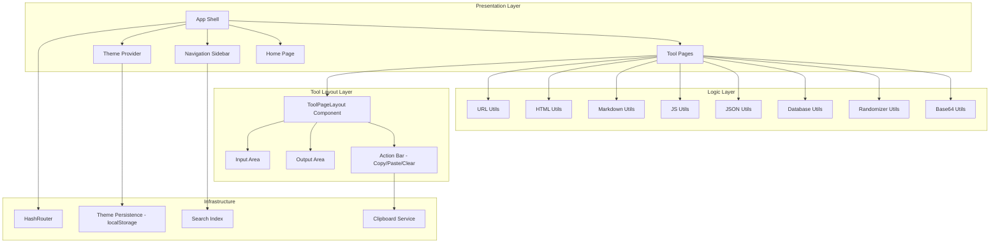
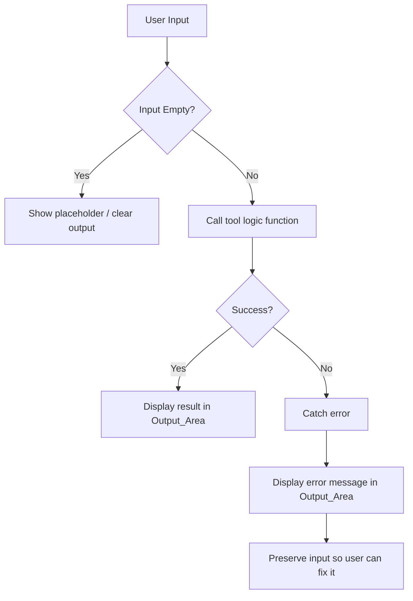

# Design Document: Dev Toolbox

## Overview

Dev Toolbox is a single-page application (SPA) built with React and TypeScript, bundled with Vite, and deployed as static files to GitHub Pages. It provides a collection of developer utilities organized into eight categories, all running entirely client-side with zero server dependencies.

The application uses a component-based architecture where each tool is a self-contained page component following a shared layout pattern (input area → processing → output area). Client-side routing via React Router's `HashRouter` ensures compatibility with GitHub Pages' static file serving. A light/dark theme system powered by CSS custom properties and React context provides a consistent visual experience.

### Key Technology Choices

| Concern | Choice | Rationale |
|---|---|---|
| Framework | React 18 + TypeScript | Component model fits tool-per-page architecture; TypeScript catches encoding/decoding bugs at compile time |
| Bundler | Vite | Fast dev server, optimized static builds, first-class React/TS support |
| Routing | React Router v6 (`HashRouter`) | Hash-based routing works on GitHub Pages without server-side redirects or 404.html hacks |
| Styling | CSS Modules + CSS custom properties | Scoped styles per component, theme switching via property overrides, no runtime CSS-in-JS cost |
| Markdown | `marked` | Lightweight CommonMark-compliant parser, runs client-side |
| JSON formatting | Native `JSON.parse` / `JSON.stringify` | Built-in, zero dependencies, handles round-trip correctly |
| SQL formatting | `sql-formatter` | Established library for SQL pretty-printing with keyword capitalization |
| JS formatting | `prettier` (standalone) | Industry-standard formatter available as a browser bundle |
| HTML processing | `DOMParser` + `XMLSerializer` (native) | Built-in browser APIs for HTML parsing and serialization |
| UUID generation | `crypto.randomUUID()` | Native Web Crypto API, RFC 4122 v4 compliant |
| Testing | Vitest + `fast-check` | Vitest integrates with Vite; fast-check provides property-based testing |

## Architecture

The application follows a layered architecture separating UI presentation from tool logic:



### Routing Structure

All routes use hash-based paths for GitHub Pages compatibility:

| Route | Component |
|---|---|
| `#/` | Home Page |
| `#/url/encode` | URL Encoder |
| `#/url/decode` | URL Decoder |
| `#/url/parse` | URL Parser |
| `#/html/encode` | HTML Encoder |
| `#/html/decode` | HTML Decoder |
| `#/html/preview` | HTML Previewer |
| `#/html/minify` | HTML Minifier |
| `#/html/prettify` | HTML Prettifier |
| `#/markdown/preview` | Markdown Previewer |
| `#/markdown/from-html` | HTML to Markdown |
| `#/js/format` | JS Formatter |
| `#/js/minify` | JS Minifier |
| `#/json/format` | JSON Formatter |
| `#/json/validate` | JSON Validator |
| `#/json/minify` | JSON Minifier |
| `#/json/to-csv` | JSON to CSV |
| `#/json/tree` | JSON Tree Viewer |
| `#/db/sql-format` | SQL Formatter |
| `#/db/mock-data` | Mock Data Generator |
| `#/random/uuid` | UUID Generator |
| `#/random/password` | Password Generator |
| `#/random/number` | Random Number Generator |
| `#/random/lorem` | Lorem Ipsum Generator |
| `#/base64/encode` | Base64 Encoder |
| `#/base64/decode` | Base64 Decoder |
| `#/base64/file` | Base64 File Encoder |

## Components and Interfaces

### App Shell

```typescript
// src/App.tsx
interface AppProps {}

// Top-level component that composes the layout
// - Wraps everything in ThemeProvider and HashRouter
// - Renders Sidebar + main content area via <Outlet />
```

### Theme System

```typescript
// src/contexts/ThemeContext.ts
type Theme = 'light' | 'dark';

interface ThemeContextValue {
  theme: Theme;
  toggleTheme: () => void;
}

// ThemeProvider reads from localStorage on mount.
// Falls back to prefers-color-scheme media query.
// Sets a data-theme attribute on <html> for CSS custom property switching.
```

### Navigation Sidebar

```typescript
// src/components/Sidebar.tsx
interface SidebarProps {
  isOpen: boolean;
  onClose: () => void;
}

interface ToolCategory {
  name: string;
  icon: string;
  tools: ToolDefinition[];
}

interface ToolDefinition {
  name: string;
  description: string;
  path: string;
}
```

### Search

```typescript
// src/components/SearchBar.tsx
interface SearchBarProps {
  query: string;
  onChange: (query: string) => void;
}

// Filters tool list by matching query against tool name and description.
// Case-insensitive substring match.
```

### Tool Page Layout

```typescript
// src/components/ToolPageLayout.tsx
interface ToolPageLayoutProps {
  title: string;
  description: string;
  children: React.ReactNode;
}

// Shared wrapper providing consistent heading, description, and spacing.
// Individual tool pages compose their own Input/Output areas within this layout.
```

### Input / Output Areas

```typescript
// src/components/InputArea.tsx
interface InputAreaProps {
  value: string;
  onChange: (value: string) => void;
  placeholder?: string;
  onPaste: () => void;
  onClear: () => void;
}

// src/components/OutputArea.tsx
interface OutputAreaProps {
  value: string;
  error?: string | null;
  onCopy: () => void;
}
```

### Clipboard Service

```typescript
// src/services/clipboard.ts
async function copyToClipboard(text: string): Promise<boolean>;
async function readFromClipboard(): Promise<string>;
```

### Tool Logic Modules (Pure Functions)

Each tool category exposes pure functions that transform input strings to output strings. These are the core units under test.

```typescript
// src/utils/url.ts
function urlEncode(input: string): string;
function urlDecode(input: string): string;
interface ParsedURL {
  protocol: string;
  host: string;
  port: string;
  path: string;
  queryParams: Record<string, string>;
  fragment: string;
}
function parseURL(input: string): ParsedURL;

// src/utils/html.ts
function htmlEncode(input: string): string;
function htmlDecode(input: string): string;
function htmlMinify(input: string): string;
function htmlPrettify(input: string): string;

// src/utils/markdown.ts
function markdownToHTML(input: string): string;
function htmlToMarkdown(input: string): string;

// src/utils/javascript.ts
async function formatJS(input: string): Promise<string>;
async function minifyJS(input: string): Promise<string>;

// src/utils/json.ts
function jsonParse(input: string): unknown;
function jsonStringify(value: unknown, indent?: number): string;
function jsonMinify(input: string): string;
function jsonFormat(input: string): string;
function jsonValidate(input: string): { valid: boolean; error?: string };
function jsonToCSV(input: string): string;

// src/utils/sql.ts
function formatSQL(input: string): string;

// src/utils/mockdata.ts
interface ColumnDefinition {
  name: string;
  type: 'string' | 'integer' | 'float' | 'boolean' | 'date' | 'email' | 'uuid';
}
interface MockDataConfig {
  columns: ColumnDefinition[];
  rowCount: number;
  outputFormat: 'json' | 'csv';
}
function generateMockData(config: MockDataConfig): string;

// src/utils/random.ts
function generateUUIDs(count: number): string[];
interface PasswordOptions {
  length: number;
  uppercase: boolean;
  lowercase: boolean;
  digits: boolean;
  special: boolean;
}
function generatePassword(options: PasswordOptions): string;
function randomInteger(min: number, max: number): number;
function generateLoremIpsum(quantity: number, unit: 'paragraphs' | 'sentences' | 'words'): string;

// src/utils/base64.ts
function base64Encode(input: string): string;
function base64Decode(input: string): string;
function base64EncodeFile(file: ArrayBuffer): string;
function getEncodedSize(base64String: string): number;
```

## Data Models

### Tool Registry

A static registry defines all tools, their categories, routes, and metadata. This drives the sidebar, home page cards, and search index.

```typescript
// src/data/toolRegistry.ts
interface ToolDefinition {
  id: string;
  name: string;
  description: string;
  path: string;           // hash route path
  category: ToolCategory;
  keywords: string[];     // for search matching
}

interface ToolCategory {
  id: string;
  name: string;
  icon: string;
  tools: ToolDefinition[];
}

// The registry is a static array of ToolCategory objects.
// Total tool count is derived: registry.flatMap(c => c.tools).length
```

### Theme Persistence

```typescript
// localStorage key: 'dev-toolbox-theme'
// Values: 'light' | 'dark'
// Read on app mount, written on toggle.
```

### Tool Page State

Each tool page manages its own local state. No global state store is needed since tools are independent.

```typescript
// Typical tool page state (managed via useState)
interface ToolPageState {
  input: string;
  output: string;
  error: string | null;
  copyConfirmation: boolean;  // true for 2 seconds after copy
}
```

### Mock Data Schema Model

```typescript
interface ColumnDefinition {
  name: string;
  type: 'string' | 'integer' | 'float' | 'boolean' | 'date' | 'email' | 'uuid';
}

interface MockDataConfig {
  columns: ColumnDefinition[];
  rowCount: number;          // 1–1000
  outputFormat: 'json' | 'csv';
}
```

### File Upload Model (Base64 File Encoder)

```typescript
interface FileEncodeResult {
  fileName: string;
  originalSize: number;      // bytes
  encodedContent: string;    // base64 string
  encodedSize: number;       // bytes
}
```

## Correctness Properties

*A property is a characteristic or behavior that should hold true across all valid executions of a system — essentially, a formal statement about what the system should do. Properties serve as the bridge between human-readable specifications and machine-verifiable correctness guarantees.*

### Property 1: URL encode/decode round-trip

*For any* valid plain text string, URL-decoding the URL-encoded representation of that string SHALL produce the original string: `urlDecode(urlEncode(s)) === s`.

**Validates: Requirements 5.1, 5.2, 5.3**

### Property 2: URL parsing extracts correct components

*For any* valid URL constructed from known components (protocol, host, port, path, query parameters, fragment), parsing the URL SHALL extract each component correctly such that the parsed parts can reconstruct the original URL.

**Validates: Requirements 5.4**

### Property 3: HTML encode/decode round-trip

*For any* valid string, HTML-decoding the HTML-encoded representation of that string SHALL produce the original string: `htmlDecode(htmlEncode(s)) === s`.

**Validates: Requirements 6.1, 6.2, 6.3**

### Property 4: HTML minify/prettify semantic equivalence

*For any* valid HTML markup, minifying then prettifying SHALL produce HTML that is semantically equivalent to the original (same DOM tree structure and text content).

**Validates: Requirements 6.5, 6.6, 6.7**

### Property 5: Markdown to HTML produces valid HTML

*For any* Markdown string, converting it to HTML SHALL produce a string that is parseable as valid HTML (no unclosed tags, well-formed structure).

**Validates: Requirements 7.1**

### Property 6: HTML to Markdown content preservation

*For any* HTML string containing basic elements (paragraphs, headings, lists, links, bold, italic), converting to Markdown SHALL preserve all text content — every text node in the original HTML should appear in the Markdown output.

**Validates: Requirements 7.4**

### Property 7: JSON parse/stringify round-trip

*For any* valid JSON string, parsing it then stringifying the result then parsing again SHALL produce a value that is deeply equal to the first parse result: `deepEqual(JSON.parse(JSON.stringify(JSON.parse(s))), JSON.parse(s))`.

**Validates: Requirements 9.1, 9.2, 9.3**

### Property 8: JSON minify/format semantic equivalence

*For any* valid JSON string, parsing the minified version SHALL produce a value deeply equal to parsing the original: `deepEqual(JSON.parse(jsonMinify(s)), JSON.parse(s))`.

**Validates: Requirements 9.7, 9.8**

### Property 9: JSON validation correctness

*For any* valid JSON string, the validator SHALL report it as valid. *For any* string that is not valid JSON, the validator SHALL report it as invalid.

**Validates: Requirements 9.5**

### Property 10: JSON to CSV structural correctness

*For any* JSON array of flat objects, converting to CSV SHALL produce output where the number of columns in the header row equals the number of unique keys across all objects, and each data row has the same number of columns as the header.

**Validates: Requirements 9.9**

### Property 11: Mock data generation matches schema

*For any* valid schema (1–1000 rows, any combination of supported column types), the generated data SHALL contain exactly the requested number of rows, and each row SHALL have a value for every column whose type matches the column definition.

**Validates: Requirements 10.3**

### Property 12: UUID v4 format compliance

*For any* generated UUID, it SHALL conform to RFC 4122 version 4 format: matching the pattern `xxxxxxxx-xxxx-4xxx-yxxx-xxxxxxxxxxxx` where `y` is one of `[8, 9, a, b]`.

**Validates: Requirements 11.1**

### Property 13: Password generation meets criteria

*For any* valid password options (length 1–128, any combination of character types with at least one enabled), the generated password SHALL have exactly the specified length and SHALL contain only characters from the enabled character sets.

**Validates: Requirements 11.3**

### Property 14: Random number within range

*For any* pair of integers (min, max) where min ≤ max, the generated random integer SHALL satisfy `min ≤ result ≤ max`.

**Validates: Requirements 11.5**

### Property 15: Base64 encode/decode round-trip

*For any* valid plain text string, Base64-decoding the Base64-encoded representation SHALL produce the original string: `base64Decode(base64Encode(s)) === s`.

**Validates: Requirements 12.1, 12.2, 12.3**

### Property 16: Search filter completeness and correctness

*For any* search query string, the filtered tool list SHALL include every tool whose name or description contains the query as a case-insensitive substring, and SHALL exclude every tool that does not match.

**Validates: Requirements 1.5**

### Property 17: Lorem Ipsum generates correct quantity

*For any* quantity (1–100) and unit (paragraphs, sentences, or words), the generated text SHALL contain exactly the requested number of the specified unit.

**Validates: Requirements 11.6**

## Error Handling

### Strategy

All tool logic functions are pure and throw descriptive errors on invalid input. The UI layer catches these errors and displays them in the Output_Area.

### Error Categories

| Category | Handling | Example |
|---|---|---|
| Invalid input format | Display error message in Output_Area with description of the problem | Malformed JSON, invalid Base64 |
| Empty input | Either show empty output or a placeholder prompt — not an error | User hasn't typed anything yet |
| Clipboard API failure | Show a toast notification explaining the browser may not support clipboard access | Clipboard permission denied |
| File too large | Display warning in Output_Area with size limit guidance | Base64 file encoder with very large file |

### Error Flow



### Error Message Format

Error messages follow a consistent pattern:
- **What went wrong**: A brief description of the error (e.g., "Invalid JSON syntax")
- **Where**: Location information when available (e.g., "at line 3, column 12")
- **Guidance**: A hint on how to fix it when possible (e.g., "Expected ',' or '}' after property value")

## Testing Strategy

### Dual Testing Approach

The project uses both unit tests and property-based tests for comprehensive coverage:

- **Unit tests** (Vitest): Verify specific examples, edge cases, error conditions, and UI behavior
- **Property-based tests** (Vitest + fast-check): Verify universal properties across randomly generated inputs

### Property-Based Testing Configuration

- **Library**: `fast-check` with Vitest
- **Minimum iterations**: 100 per property test
- **Tag format**: Each property test includes a comment referencing its design property:
  ```typescript
  // Feature: dev-toolbox, Property 1: URL encode/decode round-trip
  ```

### Test Organization

```
src/
├── utils/
│   ├── url.ts
│   ├── url.test.ts          # Unit tests for URL utils
│   ├── url.property.test.ts # Property tests for URL utils
│   ├── html.ts
│   ├── html.test.ts
│   ├── html.property.test.ts
│   ├── json.ts
│   ├── json.test.ts
│   ├── json.property.test.ts
│   ├── base64.ts
│   ├── base64.test.ts
│   ├── base64.property.test.ts
│   ├── random.ts
│   ├── random.test.ts
│   ├── random.property.test.ts
│   ├── mockdata.ts
│   ├── mockdata.test.ts
│   ├── mockdata.property.test.ts
│   ├── markdown.ts
│   ├── markdown.test.ts
│   ├── javascript.ts
│   ├── javascript.test.ts
│   ├── sql.ts
│   └── sql.test.ts
├── components/
│   ├── Sidebar.test.tsx
│   ├── SearchBar.test.tsx
│   ├── ToolPageLayout.test.tsx
│   └── ...
└── pages/
    └── HomePage.test.tsx
```

### What Gets Property Tests

| Module | Properties | Rationale |
|---|---|---|
| `url.ts` | P1, P2 | Round-trip encoding, URL parsing |
| `html.ts` | P3, P4 | Round-trip encoding, minify/prettify equivalence |
| `markdown.ts` | P5, P6 | HTML validity, content preservation |
| `json.ts` | P7, P8, P9, P10 | Round-trip, minify equivalence, validation, CSV structure |
| `mockdata.ts` | P11 | Schema conformance |
| `random.ts` | P12, P13, P14, P17 | UUID format, password criteria, range bounds, lorem quantity |
| `base64.ts` | P15 | Round-trip encoding |
| Search logic | P16 | Filter completeness |

### What Gets Unit Tests Only

| Module | Rationale |
|---|---|
| `javascript.ts` | Thin wrapper around Prettier; test integration with examples |
| `sql.ts` | Thin wrapper around sql-formatter; test integration with examples |
| UI components | DOM rendering, user interactions, clipboard behavior |
| Theme system | Two-value domain (light/dark); examples suffice |
| Routing | HashRouter integration; example-based navigation tests |

### Test Commands

```bash
# Run all tests
npm run test

# Run only property tests
npm run test -- --grep "property"

# Run tests for a specific module
npm run test -- url
```
